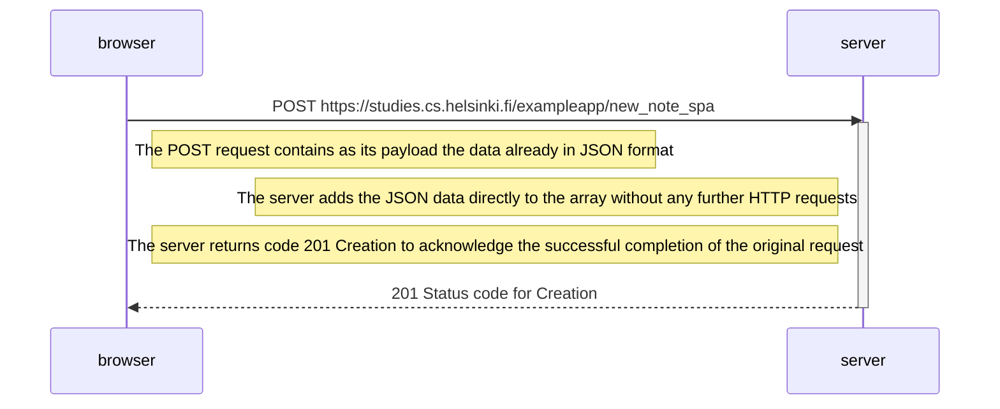

```mermaid
sequenceDiagram
    participant browser
    participant server

    browser->>server: POST https://studies.cs.helsinki.fi/exampleapp/new_note_spa
    activate server

    Note right of browser: The POST request contains as its payload the data already in JSON format

    Note left of server: The server adds the JSON data directly to the array without any further HTTP requests
    Note left of server: The server returns code 201 Creation to acknowledge the successful completion of the original request


    
    server-->>browser: 201 Status code for Creation
    deactivate server
```
